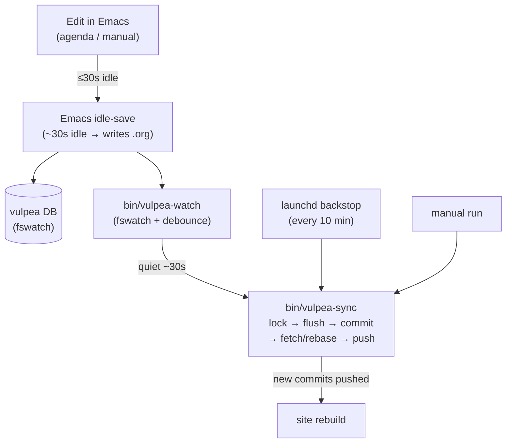

# Vulpea note sync

Keeps my [vulpea](https://github.com/d12frosted/vulpea) notes (`~/vulpea`, a git
repo) mirrored to the remote and drives the site rebuild that happens on push.
The goal is **fast and lossless**: a note change should reach the remote about a
minute after I stop editing, and it should never quietly leave edits behind.

## Flow

## Pieces

| Piece | Role |
|---|---|
| Emacs idle-save | `vulpea-idle-save-flush` on a timer (in [`emacs/lisp/init-vulpea.el`](../emacs/lisp/init-vulpea.el), helper in [`emacs/lisp/lib-buffer.el`](../emacs/lisp/lib-buffer.el)) writes modified org buffers to disk after a short idle. |
| [`bin/vulpea-watch`](../bin/vulpea-watch) | KeepAlive `fswatch` daemon; debounces file changes and calls `vulpea-sync` once things settle. |
| [`bin/vulpea-sync`](../bin/vulpea-sync) | Does the actual work: lock, flush unsaved buffers, commit, fetch/rebase, push. |
| [`launchd/io.d12frosted.vulpea-watch.plist`](../launchd/io.d12frosted.vulpea-watch.plist) | Runs the watcher (KeepAlive). |
| [`launchd/io.d12frosted.vulpea-sync.plist`](../launchd/io.d12frosted.vulpea-sync.plist) | The 10-minute backstop. |

## Design notes

The parts that aren't obvious from reading any single file:

- **Debounce + backstop, not a shorter poll.** A fixed interval trades publish
  latency against rebuild churn — shorten it and a long editing session pushes
  (and rebuilds) every few minutes. Debouncing wins both: publish ~1 min after
  you stop, one rebuild per editing burst.
- **Idle-save is the trigger source.** `fswatch` only sees *saved* files, so
  without idle-save nothing would ever fire the watcher — and the fswatch-driven
  vulpea DB would lag behind Emacs too.
- **`.git` and Emacs scratch files are excluded from the watch.** Otherwise the
  sync's own git writes (or `#foo#` / `.#foo` autosave churn) would retrigger the
  watcher: a feedback loop.
- **One lock, three triggers.** The watcher, the backstop, and manual runs all
  funnel through `vulpea-sync`. macOS has no `flock(1)`, so it takes an atomic
  `mkdir` lock (with a pid + staleness check) so runs never overlap.
- **fetch/rebase runs even when there's nothing to commit.** The notes repo has
  several writers — mobile captures, the `dor` pipeline, manual commits — so
  pulling is useful work regardless of local changes. Only the final `push` is a
  no-op when idle, and that's a cheap ref check.
- **Idle-save never edits the buffer.** The flush binds
  `buffer-save-inhibit-mutations`, which suspends the before-save hooks that
  mutate content (`vulpea-id-auto-assign` property drawers,
  `vulpea-ensure-filetag`, ws-butler whitespace trimming). Without this,
  resuming typing after an idle pause landed in a buffer that had just changed
  under point. All that maintenance still runs on manual saves.
- **The emacsclient flush is belt-and-suspenders.** Idle-save usually beats the
  sync, but flushing buffers right before the commit guarantees it captures the
  very latest even if the backstop fires mid-edit.
- **Conflicts stop and shout; network hiccups stay quiet.** A rebase conflict
  aborts and fires a notification (it needs a human); offline fetch/push failures
  are only logged, since the next run heals them and notifying every 10 minutes
  would be noise.

## Tuning

| Knob | Where | Default |
|---|---|---|
| idle-save delay | `vulpea-idle-save-seconds` (Emacs) | 30s |
| debounce quiet period | `VULPEA_WATCH_DEBOUNCE` (env for `vulpea-watch`) | 30s |
| backstop interval | `StartInterval` in the sync plist | 600s |

Edit → publish latency ≈ idle-save + debounce ≈ ~1 min.

## Operations

- **Logs:** `~/.local/share/vulpea-sync/{stdout,stderr}.log` (sync) and
  `watch-{stdout,stderr}.log` (watcher).
- **Lock:** `${XDG_DATA_HOME:-~/.local/share}/vulpea-sync/sync.lock` — removed on
  exit; a dead-owner or >10-min ownerless lock is taken over automatically.
- **Activation:** `./eru.sh install services` symlinks and loads both launchd
  jobs; the Emacs idle-save takes effect on the next config reload.
